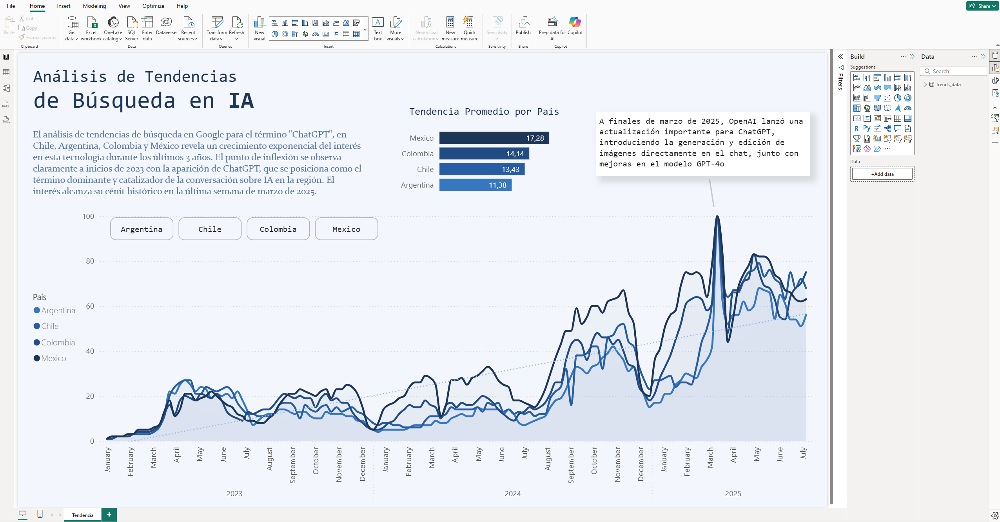
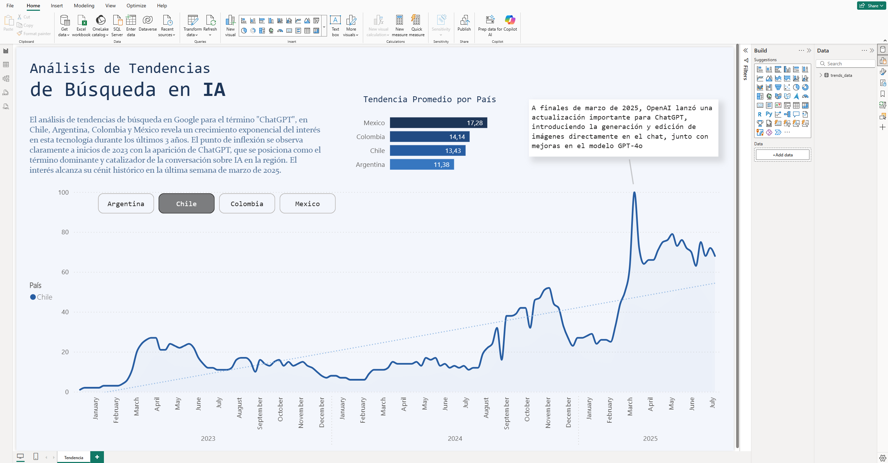

# 📊 Análisis de Tendencias de IA en LATAM

## Descripción General
Este proyecto analiza las tendencias de adopción y uso de Inteligencia Artificial en los países de América Latina. El dashboard interactivo en Power BI proporciona visualizaciones detalladas sobre el crecimiento, adopción y casos de uso de IA en la región.

## 📁 Archivos del Proyecto

- **`Analisis tendencia IA.pbix`** - Dashboard interactivo en Power BI con análisis completo de tendencias de IA en LATAM

## 📈 Visualizaciones

### Vista Principal - Tendencias Generales

### Análisis Detallado por País

## 🎯 Objetivos del Análisis

- Identificar patrones de crecimiento de IA en América Latina
- Comparar niveles de adopción entre países
- Analizar sectores con mayor uso de IA
- Evaluar impacto económico y laboral
- Proyectar tendencias futuras

## 🔧 Herramientas Utilizadas

- **Power BI** - Visualización y análisis interactivo
- **Fuentes de datos** - Organismos internacionales, estudios de mercado, reportes de industria

## 📊 Métricas Clave

- Índice de adopción de IA
- Inversión en proyectos de IA
- Crecimiento anual de implementación
- Sectores prioritarios
- Talento especializado disponible

## 💡 Insights Principales

Este análisis proporciona insights sobre:
- Líderes tecnológicos en la región
- Oportunidades de crecimiento
- Brechas en adopción de tecnología
- Recomendaciones para impulsar la transformación digital

## 📌 Cómo Usar

1. Descargar o abrir `Analisis tendencia IA.pbix` en Power BI Desktop
2. Interactuar con los filtros para explorar datos por país, sector y período
3. Usar los gráficos interactivos para análisis cruzado
4. Exportar reportes según necesidad

## ✨ Características del Dashboard

- ✅ Filtros dinámicos por país y período
- ✅ Gráficos interactivos y actualizables
- ✅ Análisis comparativo entre naciones
- ✅ Proyecciones y tendencias futuras
- ✅ Indicadores KPI en tiempo real

---

**Última actualización:** Noviembre 2025  
**Autor:** Data Projects Portfolio  
**Estado:** ✅ Completado
