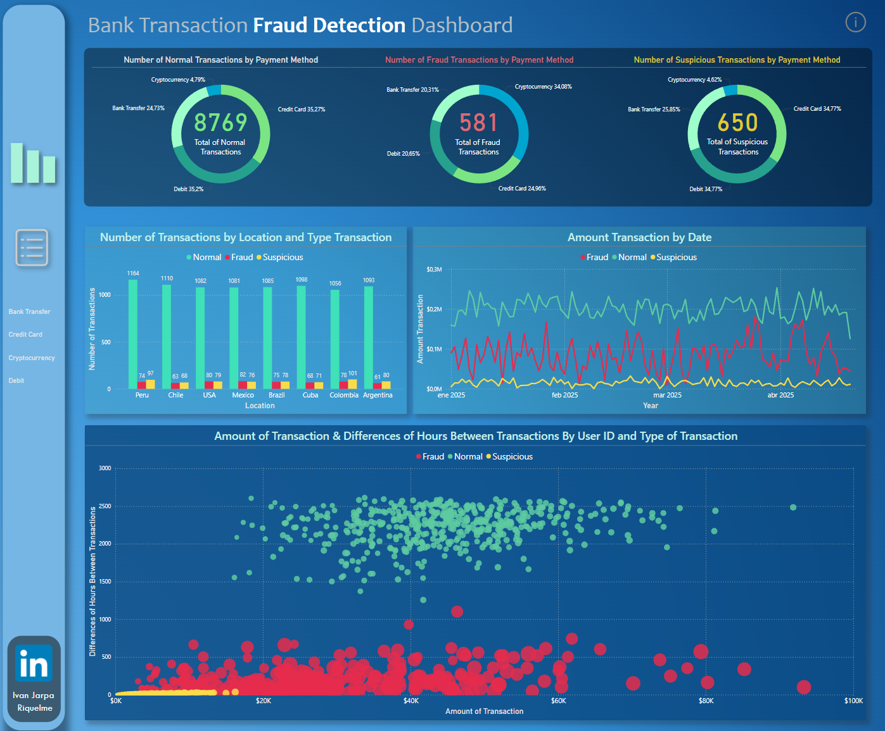

# 💳 Bank Transaction Fraud Detection Dashboard

This project simulates and visualizes fraudulent banking transactions using Python for dataset generation and Power BI for interactive dashboards. It's designed to explore fraud patterns across different countries, payment methods, and user behaviors.
## 📊 Dashboard

## 🧪 Dataset Generation (Python)

The dataset was created using Python with the help of the `Faker`, `NumPy`, and `Pandas` libraries. It includes:

- 10,000 generated transactions
- 500 unique users
- Geographic coordinates for 8 countries
- 4 payment methods: Credit Card, Debit, Bank Transfer, Cryptocurrency
- Realistic timestamps, locations, and fraud behaviors

Fraudulent transactions have:
- Higher average amounts
- Higher likelihood of using **cryptocurrency**
- Slightly different geographic patterns

📁 Dataset saved as `fraudulent_transactions.csv` for import into Power BI.

## 🛠️ Technologies Used

- Python (Pandas, NumPy, Faker)
- Power BI
- Git & GitHub

## 🔍 Use Case

This project is useful for:

- Data analysts exploring fraud detection use cases
- Students or professionals learning dashboard creation
- Demonstrating ETL + Visualization capabilities for your portfolio

## 🌐 Author

**Iván Jarpa Riquelme**  
Data Analyst | Financial & Business Intelligence | Python | SQL  
🔗 [LinkedIn](https://www.linkedin.com/in/ijarpa/)  
📧 Contact available via LinkedIn