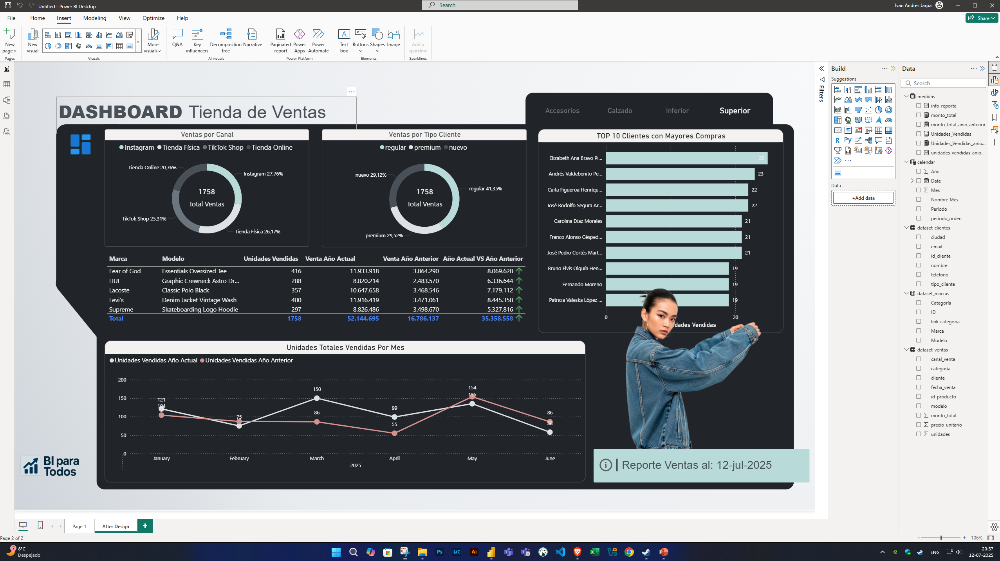

# 🛍️ Dataset de Ventas y Clientes - Simulación para Power BI

Este repositorio contiene un **conjunto de datos ficticio** generado con Python, pensado como recurso educativo para aprender a utilizar **Power BI** y realizar análisis de ventas y clientes.

## 📊 Dashboard Final


## 📄 Descripción

Se han generado dos archivos `.csv`:

- `ventas_dataset.csv`: Contiene registros de ventas simuladas de una tienda de moda.
- `clientes_dataset.csv`: Contiene información detallada de 200 clientes ficticios.

Ambos datasets están diseñados para poder conectarse mediante el campo `cliente` / `id_cliente`, permitiendo construir relaciones en Power BI y realizar análisis cruzados.

---

## 🧠 Propósito educativo

Este dataset es ideal para practicar en Power BI:

- Modelado de datos y relaciones entre tablas
- Visualizaciones de ventas por categoría, canal o ciudad
- Análisis de clientes y segmentación
- Medidas DAX personalizadas (margen, total anual, cliente top, etc.)
- Uso de filtros, slicers y dashboards interactivos

---

## 🛠️ Requisitos

Para regenerar o modificar los datasets, necesitarás:

- Python 3.x
- Librerías: `pandas`, `random`, `Faker`

Instalación rápida de dependencias:

```bash
pip install pandas faker
```
```bash
contenido
├── dataset_ventas.csv
├── dataset_clientes.csv
├── dataset_marcas.csv
├── dataset.ipynb (notebook con el script)
└── README.md
